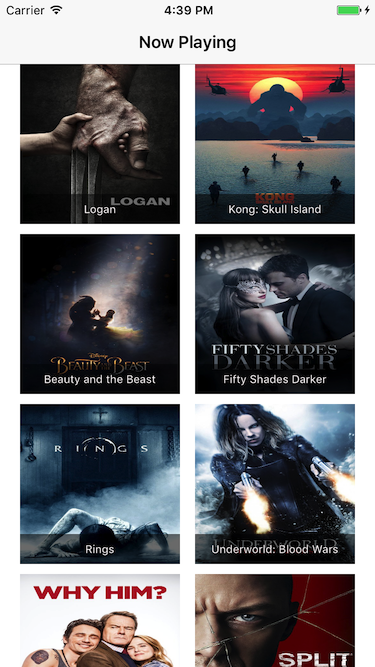
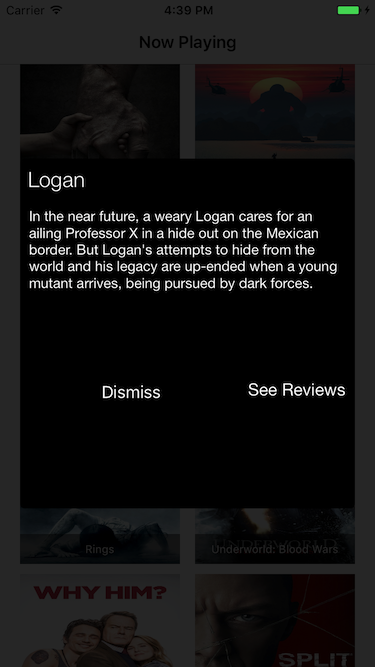

# MovieHound
An app to let you know about upcoming movies, their reviews and song credits. Work in Progress :) 

1. Accesses the [Movie Databases API](https://www.themoviedb.org/documentation/api) to display now playing movies.
2. UICollectionView Cells that hold movie thumbnails and titles can be tapped to reveal: A. a description and  B: a link to reviews (In progress). 
3. Uses the delegate pattern from UIKit.
4. Accesses [NYT Movie Review API](https://developer.nytimes.com/movie_reviews_v2.json#).

Going to use a [library](https://github.com/rs/SDWebImage) to Cache the poster images instead of having a custom one 

# License 
Code is released under MIT 
